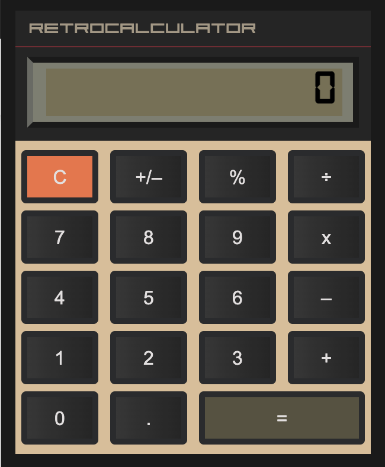

# Calculator

## https://retro-calculator-js.netlify.app/

## Purpose 

The purpose of this project is to create a calculator using Javascript with the help of HTML and SCSS.

## Tech stack
- **Javascript**
- **HTML** 
- **SCSS** 

### Breakdown

- Implent clear button
- Show 0 at display
- Make Number buttons work
- Show numbers in display
- Make dot button work
- Show dot in display
- Making Operators work
- Show operators in display
- Implement equal sign
- Showing calculation

